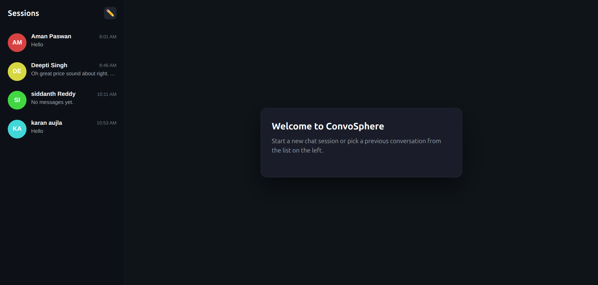
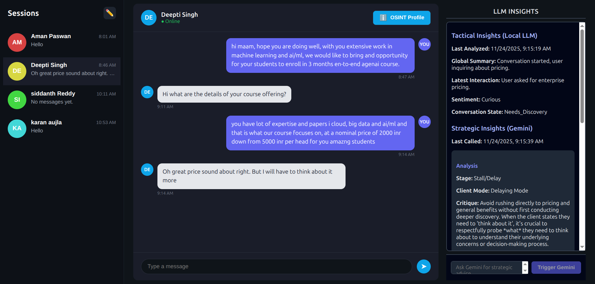
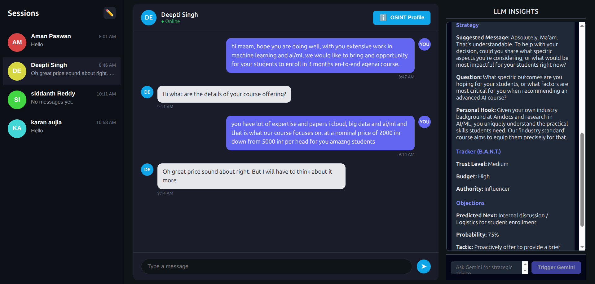
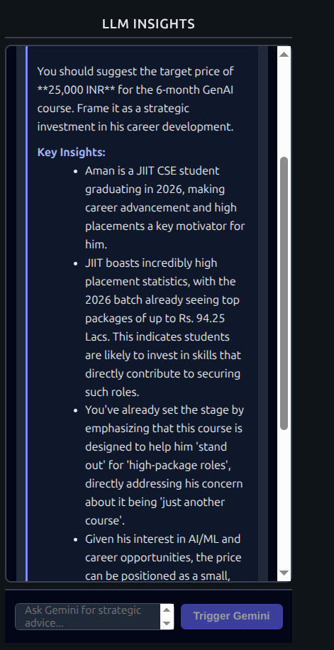
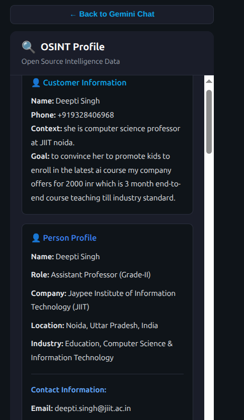
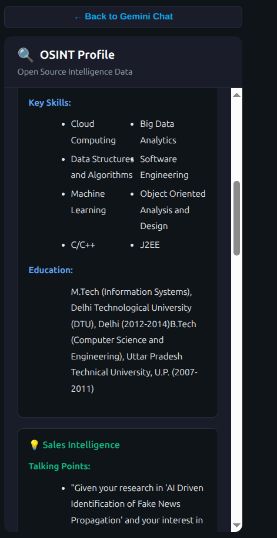
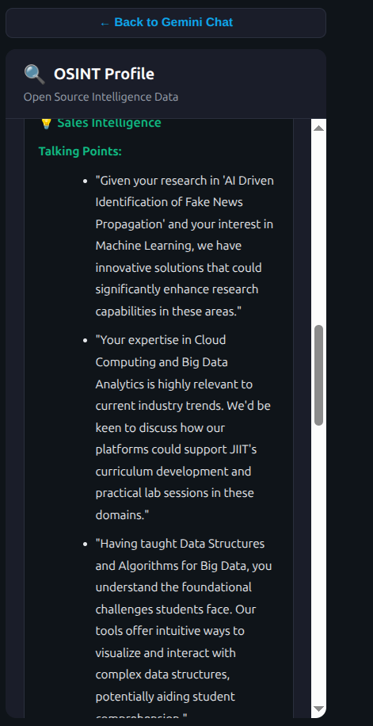
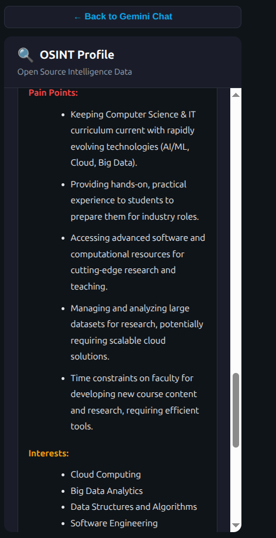

# ConvoSphere: OSINT-Powered Sales Intelligence Assistant

ConvoSphere is an outbound sales intelligence system that combines **OSINT** and **multi-layered AI analysis** to coach a salesperson during real conversations. It enriches a person’s profile (contact, social, company, digital footprint), tracks live chat over Telegram, and uses a **local LLM (Ollama)** plus **Google Gemini** to assess current converstaion and suggest the next best actions, helping increase sales call success rates and reduce sales call times significantly.

---

## 1. What ConvoSphere Does

- **Enrich leads automatically** using a phone number, name, and short context.
- **Aggregate OSINT** from multiple external tools into a unified person/company profile.
- **Run live conversations** via Telegram, storing all messages as sessions.
- **Analyze conversations tactically** with a local LLM (Ollama / `phi3:3.8b`).
- **Analyze conversations strategically** with Gemini, producing rich JSON advice.
- **Alerts** with red flags, BANT-style insights, predicted objections, and suggested next messages.
- **Ask Gemini for help** with a free-form query.
- **Direct messages suggestions** for the salesperson to the customer backed by citext and goal-oriented insights.
- **Surface everything in a React UI** with:
  - Sessions sidebar
  - Telegram chat pane
  - OSINT details pane
  - Gemini "intelligence" pane

Typical use case: a salesperson starts a session for a new prospect, enters known details and goal, lets OSINT run, then chats over Telegram while ConvoSphere continuously analyzes the conversation and suggests how to steer it.

---

## 2. UI Walkthrough & Screenshots

All screenshots live in the `images/` folder.

### 2.1 Starting a Session
<p align="center">
  
</p>

- Start a new conversation by entering name, phone, context, and goal.

### 2.2 Conversation Workspace & Gemini Strategic Advice

<p align="center">
  
  
  <!--  -->
</p>

- Left: sessions and navigation.
- Center: Telegram-style chat.
- Right: togglable Gemini and OSINT panes, with Gemini strategic advice alongside the conversation.

### 2.3 OSINT Intelligence

<p align="center">
  
  
  
  
</p>

- Detailed person and company profile built from aggregated OSINT.
- Talking points, risks, and opportunities for the salesperson.

---

## 3. Key Capabilities

- **OSINT Enrichment Pipeline** (implemented in `orchestrator.py` + `tool_wrappers.py`):
  - Phone validation with **Numverify**.
  - Name/context parsing and reasoning with **Gemini**.
  - First-wave discovery via **Twitter/X**, **LinkedIn (BrightData)**, and **Google search (SerpAPI)**.
  - Link filtering with Gemini, then content scraping via **Firecrawl**.
  - Additional link extraction and scraping from social profiles.
  - Gemini interleaved in these api calls to filter links and scrape content and decide on next steps based on previous steps output.
  - Final Gemini pass that builds a **verified person profile + sales intelligence JSON**.

- **Session & Messaging Layer** (mainly in `api.py` + `services/telegram_router.py`):
  - Session creation with customer info, goal, and context.
  - Messages stored per session, with sender (`agent`/`customer`) and channel (`telegram`).
  - Outbound Telegram via **Telethon**; inbound messages routed back into the correct session.
  - WebSocket channel per session (`/ws/{session_id}`) to push live updates to the UI.

- **AI Analysis Layer**:
  - **Local LLM (tactical)** – `services/local_llm_service.py`
    - Uses **Ollama** (`phi3:3.8b`) running locally.
    - Given recent messages + goal, returns JSON with:
      - Global summary
      - Latest interaction summary
      - Current sentiment
      - Conversation state tag (Initializing, Rapport_Building, Needs_Discovery, etc.).
  - **Gemini (strategic)** – `gemini_client.py` + `run_gemini_call` in `api.py`
    - Uses OSINT, local LLM output, and recent messages.
    - Produces structured JSON with:
      - Stage & client mode
      - Red flags & BANT-style insights
      - Suggested next message and personal hooks
      - Predicted objections and tactics.

---

## 3. High-Level Architecture

- **Frontend (React + Vite)** – `frontend/`
  - Main app in `src/App.tsx`.
  - Talks to FastAPI over HTTP and subscribes to updates via WebSocket.
  - Key panes:
    - `Sidebar`: sessions list + "New Session" form.
    - `TelegramChatPane`: live chat + send messages.
    - `OsintPane`: enriched OSINT view for the active session.
    - `GeminiChatPane`: Gemini analysis and queries.

- **Backend (FastAPI)** – `api.py`
  - Manages sessions, messages, alerts, and AI calls.
  - Uses **FastAPI BackgroundTasks** to run OSINT, local LLM, and Gemini work asynchronously.
  - Pushes session updates over WebSockets via `ConnectionManager` (`services/connection_manager.py`).

- **OSINT Orchestrator & Tooling**
  - `orchestrator.py`: `PersonOSINTOrchestrator.enrich_person(phone, name, context)` implements the multi-step OSINT pipeline.
  - `tool_wrappers.py` + fetcher scripts:
    - `numverify_fetcher.py`, `twitter_info_fetcher.py`, `linkedin_info_fetcher.py`, `serpapi_tester.py`, `firecrawler_linkcrawler.py`.

- **Messaging & Routing**
  - `services/telegram_router.py` wraps Telethon:
    - Sends messages to Telegram (`send_message`).
    - Listens for inbound messages and forwards them to `/api/sessions/{id}/messages`.

- **State & Storage**
  - **MongoDB** (via `db/database.py` + `schemas.py`):
    - Stores sessions, messages, OSINT, local LLM, Gemini, alerts.
  - **Redis**: used as cache/queue backend (see `docker-compose.yml` for a dev Redis service).

---

## 4. Core Data Model (Simplified)

The main unit is a **Session** (see `schemas.py`). In simplified form:

- **Session**
  - `session_id`: unique ID (also Mongo `_id`).
  - `owner`: salesperson / agent ID.
  - `customer`:
    - `name`, `phone`, `context`, `goal`, optional `telegram_user_id`, etc.
  - `messages`: list of **Message** objects.
  - `osint`: OSINT status + enriched data (final Gemini summary from orchestrator).
  - `local_llm`: latest tactical JSON from the local LLM.
  - `gemini`: latest strategic JSON from Gemini, including `query_type` and `user_query`.
  - `alerts`: list of **Alert** objects (thresholds, red flags, etc.).
  - `status`, `created_at`, `updated_at`.

- **Message**
  - `sender`: `agent` or `customer`.
  - `text`, `channel` (e.g. `telegram`).
  - `timestamp`.

---

## 5. Main Flows

### 5.1 Session Creation + OSINT Enrichment

1. Agent opens the React UI and fills the "New Session" form.
2. Frontend calls `POST /api/sessions` with `CreateSessionRequest`.
3. Backend creates the session in MongoDB and triggers `run_osint_enrichment(session_id)` as a background task.
4. `run_osint_enrichment`:
   - Loads customer `name`, `phone`, `context`.
   - Calls `PersonOSINTOrchestrator.enrich_person(...)`.
   - Updates `session.osint` with `status`, raw data, and `final_summary`.
5. When OSINT is ready, the updated session is pushed to the UI via WebSocket.

### 5.2 Live Messaging via Telegram

1. Agent sends a message from the UI.
2. UI calls `POST /api/sessions/{id}/send`.
3. Backend uses `TelegramRouter.send_message` to deliver it over Telegram (or mock, if not configured).
4. Message is appended to `session.messages` and pushed to the UI over WebSocket.
5. When the customer replies, Telethon listener in `TelegramRouter`:
   - Resolves the correct session by Telegram user ID / phone / username.
   - Calls `POST /api/sessions/{id}/messages` to append the message.
   - Triggers local LLM analysis in the background.

### 5.3 Tactical Analysis (Local LLM)

1. Any new message to a session triggers `run_local_llm_analyze`.
2. This worker builds a payload with:
   - Recent messages (`short_context`).
   - Customer info and goal.
3. It calls `LocalLLMService.analyze(...)` which uses Ollama to generate JSON.
4. The JSON is stored in `session.local_llm` and broadcast over WebSocket.
5. `run_local_llm_analyze` may also trigger Gemini for a deeper strategic review (e.g., on customer replies).

### 5.4 Strategic Analysis (Gemini)

1. Gemini can be triggered either:
   - Automatically from `run_local_llm_analyze`, or
   - Manually via `POST /api/sessions/{id}/trigger_gemini`.
2. `run_gemini_call` assembles a payload with:
   - Customer info
   - OSINT `final_summary`
   - Last N messages
   - Local LLM output
   - A `task` string (either a free-form user query or a strategic review).
3. It sends a large prompt to **Gemini** via `GeminiClient`, expecting JSON.
4. The parsed JSON is stored to `session.gemini` and pushed to the UI.

---

## 6. Setup & Running Locally

### 6.1 Prerequisites

- **Runtime**
  - Python **3.10+**
  - Node.js **18+**

- **Services**
  - MongoDB (default `mongodb://localhost:27017`).
  - Redis (for background tasks). normal running or For dev you can run:
    ```bash
    docker compose up -d redis
    ```

- **External Tools / APIs** (configured via `.env` – see `.env.example`)
  - Numverify API key
  - SerpAPI key
  - Firecrawl API key
  - BrightData / LinkedIn scraping configuration
  - Twitter/X credentials (for Tweepy)
  - Telegram API ID / hash (for Telethon)
  - Google Gemini API key
  - Ollama runtime with `phi3:3.8b` model pulled locally

### 6.2 Backend Setup

```bash
git clone https://github.com/gautam642/ConvoSphere.git
cd ConvoSphere

python -m venv venv
source venv/bin/activate  # Linux/macOS

pip install -r requirements.txt
cp .env.example .env      # then fill in API keys + DB URLs
```

Start MongoDB and Redis, then run FastAPI:

```bash
uvicorn api:app --reload
```

- API root: `http://127.0.0.1:8000/`
- Docs: `http://127.0.0.1:8000/docs`
- WebSocket per session: `ws://localhost:8000/ws/{session_id}`

### 6.3 Frontend (React + Vite)

```bash
cd frontend
npm install
npm run dev
```

- UI: `http://localhost:5173`

The backend CORS is already configured to allow `http://localhost:5173`.

---

## 7. API Surface (Summary)

Implemented in `api.py` (see `schemas.py` for request/response models):

- `GET /` – Health/info.
- `POST /api/sessions` – Create a new session and trigger OSINT.
- `GET /api/sessions` – List sessions.
- `GET /api/sessions/{session_id}` – Get a specific session.
- `POST /api/sessions/{session_id}/messages` – Append a message (used by Telegram webhook/receiver).
- `POST /api/sessions/{session_id}/send` – Send outbound message (Telegram) and append it to the session.
- `POST /api/sessions/{session_id}/trigger_gemini` – Trigger a Gemini call with a user question or default strategic review.
- `POST /webhook/telegram` – Placeholder webhook receiver for Telegram inbound messages.
- `WS /ws/{session_id}` – WebSocket for live session updates (messages, OSINT, LLM, Gemini).


## 8. Testing & Development

- Core tests live in `tests/` and top-level `test_*.py` files.
- To run tests:

```bash
pip install pytest httpx
pytest
```

This will exercise key API endpoints and parts of the OSINT/LLM pipeline (with mocks where appropriate).

